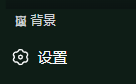
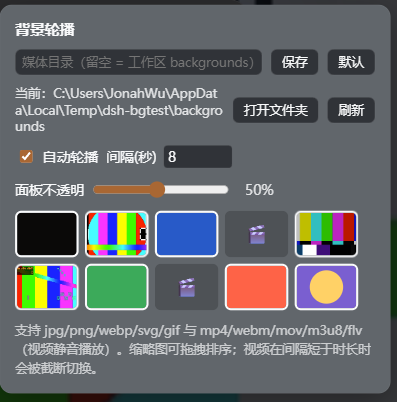

<h1 align="center">dsh-bg-carousel</h1>

<p align="center">图片与视频自动轮换的 DeepSeek Harness 界面背景。</p>

<p align="center">
  <a href="https://github.com/Jonah-Wu23/dsh-bg-carousel/releases"></a>
  
  <a href="LICENSE"></a>
</p>

<p align="center">
  <a href="#安装">安装</a> ·
  <a href="#api">API</a> ·
  <a href="#从源码构建">从源码构建</a>
</p>

## 30 秒了解

**媒体目录里的图片和视频按设定间隔轮换为 dsh 界面背景。视频静音播放，界面透明度随时可调。**

dsh-bg-carousel 是一个标准 dsh bundle 插件，适配 dsh v0.1.2-alpha.1 的 web 界面。宿主端扫描媒体目录，通过 webServer 提供媒体路由；客户端在侧边栏底部注册「背景」入口，负责控制面板。

> **兼容性**：插件基于 dsh v0.1.2-alpha.1 开发，不兼容 dsh v0.1.1-rc2。client slots 注册接口在 v0.1.2-alpha.1 中有破坏性变更，旧版本 dsh 无法加载本插件的面板。

- 图片经 body 背景渲染，压暗色随亮暗主题自动取值
- 视频以固定定位层铺满视口，静音自动播放
- 「面板不透明」滑杆实时调整界面 token 透明度，对图片和视频同样生效
- 目录、顺序、间隔在面板内修改，保存即生效

标准 dsh bundle · MIT · 适配 dsh v0.1.2-alpha.1

## 功能总览

| 功能 | 说明 |
| --- | --- |
| 媒体目录 | 面板内直接填写本地目录，保存即生效；目录不可用时回退默认目录并提示。 |
| 图片轮播 | JPEG、PNG、WebP、SVG、GIF，按 body 背景渲染。 |
| 视频背景 | MP4、WebM、MOV、HLS、FLV，静音自动播放，cover 方式铺满。 |
| 混合轮换 | 间隔短于视频时长时截断当前视频并切换；长于时长时播完立即切换。 |
| 顺序调整 | 缩略图拖拽排序，顺序持久化到服务端设置。 |
| 透明度 | 「面板不透明」滑杆实时生效，图片和视频一致。 |

## 使用说明

### 打开面板

侧边栏底部有「背景」入口，点击后打开控制面板。面板打开时会自动加载当前目录的媒体清单。



### 配置媒体目录

面板顶部输入框填写本地目录，支持绝对路径与工作区相对路径。「保存」立即重新扫描，「默认」恢复自动探测（工作区 `backgrounds` 目录）。目录不存在、无法读取或没有受支持的文件时，面板显示原因；配置目录不可用时回退默认目录，轮播照常。



### 轮换与排序

自动轮播按设定间隔切换到下一个媒体。间隔短于视频时长时，插件截断当前视频并切换下一个；间隔长于时长时，视频自然播完后立即切换；视频卡死时由定时器兜底推进。拖拽缩略图可调整顺序，顺序立即生效并持久化，新增文件按字母序排在末尾。

### 视频播放

视频静音、自动播放，以 cover 方式铺满视口，表面叠一层随主题取色的压暗渐变。环境限制自动播放时停在首帧，定时器照常推进。无法解码的文件自动跳过，浏览器控制台记录原因；全部媒体失败时暂停轮播并在面板提示。

### 格式兼容性

HLS 由 Safari 原生支持；FLV 需要 MSE 类扩展（如 flv.js）。Chromium 环境下这两类文件自动跳过，轮播继续。MOV 能否播放取决于容器内编码，H.264 编码通常可以播放。

## 安装

插件需要 webServer 与 client UI，建议安装到 web profile（或任何包含 `@deepseek-ai/dsh-web-app` 的 profile）。安装到其他 profile 时插件静默待命，不影响启动。

插件基于 dsh v0.1.2-alpha.1，不兼容 dsh v0.1.1-rc2，安装前请确认 dsh 版本。

以下三种方式**任选其一**，每次只执行一条命令。命令在 PowerShell、CMD 与 bash 中相同，需要 `pnpm` 在 PATH 中。

方式一：GitHub Release tgz

```bash
dsh plugin --profile web add https://github.com/Jonah-Wu23/dsh-bg-carousel/releases/download/v0.2.0/dsh-external-dsh-bg-carousel-0.2.0.tgz
```

方式二：git 源

```bash
dsh plugin --profile web add github:Jonah-Wu23/dsh-bg-carousel
```

方式三：本地路径，`<...>` 处填 tgz 文件路径或插件目录路径

```bash
dsh plugin --profile web add <本地 tgz 或目录路径>
```

安装后重启 dsh 生效，卸载使用 `dsh plugin --profile web remove @dsh-external/dsh-bg-carousel`。

## 使用

1. 把图片和视频复制到媒体目录（默认工作区 `backgrounds`，可在面板里修改）
2. 点击侧边栏底部「背景」打开面板
3. 点击缩略图切换背景，拖拽缩略图排序，勾选「自动轮播」按设定间隔循环，「面板不透明」滑杆调整界面透明度

## API

宿主在 `{workspaceRoot}` 下挂载两个 prefix 路由：

| 方法 | 路径 | 说明 |
| --- | --- | --- |
| GET | `/dsh-bg/img/<name>` | 按文件名返回媒体字节，缓存 1 小时，图片上限 64 MiB、视频 256 MiB |
| GET | `/dsh-bg/api/list` | 返回 `images`、`videos`、`media`（混合清单）、`dir`、`dirError` 与设置 |
| POST | `/dsh-bg/api/image` | 按文件名返回 base64 data URL，限制 12 MiB，兼容旧版 client |
| POST | `/dsh-bg/api/settings` | 更新 `intervalMs`（1500–120000）、`enabled`、`panelOpacity`（0.1–0.95）、`mediaDir`、`order` |

`GET /list` 的 `media` 为 `{name, kind: 'image' \| 'video'}[]`，已按 order 排序；`dirError` 非空表示配置目录不可用、已回退默认目录。

## 从源码构建

环境要求：一份 dsh 源码 checkout，PATH 中有 bash 与 Node.js。

```bash
DSH_CHECKOUT=<dsh 源码 checkout> bash scripts/build.sh
```

脚本使用 checkout 内的 `tsc` 编译宿主端，`tsdown` 打包 client（`window.__ModuleLoader__` bundle），`@types/react` 做 client 类型检查。仓库内置 `lib/` 为已构建产物，可直接使用。

运行时零新增依赖：client 只 require 平台种子模块 `react`；未引入 hls.js 或 flv.js，环境不支持的格式自动跳过。

发布：打 tag `v*` 触发 GitHub Actions 执行 `npm pack`，并把 `dsh-bg-carousel-<version>.tgz` 附加到 Release（见 [.github/workflows/release.yml](.github/workflows/release.yml)）。

## 许可

代码采用 [MIT License](LICENSE)。
